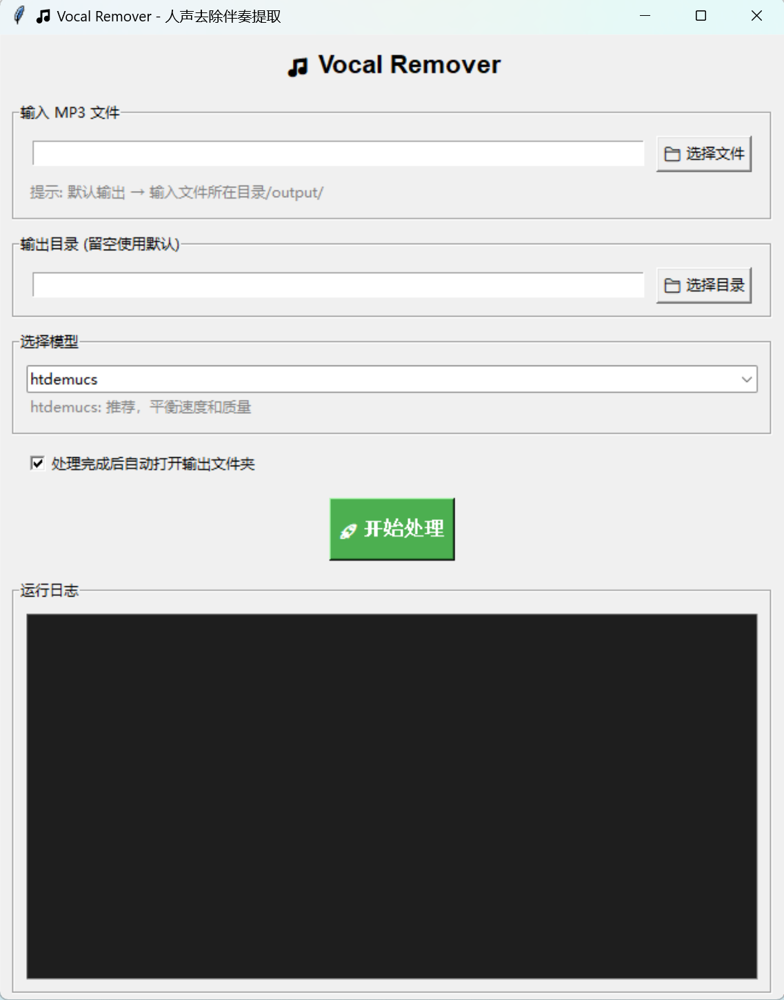

# Vocal Remover - Extract Instrumental Accompaniment from Music

Remove vocals from MP3 music and extract instrumental accompaniment using Meta AI's Demucs pre-trained deep learning model.

[中文说明 (Chinese README)](README.zh-CN.md)

## Features

- 🎵 Remove vocals from any MP3 song, keep only instrumental accompaniment
- ✅ Supports MP3 input format
- 📦 Outputs **both WAV (lossless) and MP3 (320kbps)** formats by default
- 🏆 Uses Demucs (htdemucs model) - state-of-the-art open source source separation
- 🐍 Works with Python 3.8+ including Python 3.14
- 🔧 Works around torchcodec/ffmpeg compatibility issues
- 🖥️ **Graphical User Interface** available - no command line needed!

## Installation

```bash
git clone https://github.com/freepasta/vocal-remover.git
cd vocal-remover
pip install -r requirements.txt
```

**Note:** First run will automatically download the pre-trained model (~300MB).

You need **ffmpeg** for MP3 decoding/encoding:
- Windows: Download ffmpeg and add it to PATH, or extract the ffmpeg folder to `bin/`
- macOS: `brew install ffmpeg`
- Linux: `sudo apt install ffmpeg`

## Usage

### Graphical User Interface (Recommended)

Just run:
```bash
python gui.py
```

A GUI window will open, just:
1. Click **[Select File]** to choose your MP3
2. Output directory will be set automatically (defaults to `input_folder/output/`)
3. Click **[Start Processing]** and wait
4. When done, it will automatically open the output folder for you

<p align="center">
  
</p>

### Command Line Usage

```bash
# Add ffmpeg to PATH (if not already in PATH)
export PATH="$PWD/bin/ffmpeg-master-latest-win64-gpl/bin:$PATH"

python vocal_remover_api.py your_song.mp3
```

Output will be in:
```
output/htdemucs/your_song/
├── no_vocals.wav    # Lossless instrumental accompaniment
├── no_vocals.mp3    # 320kbps MP3 instrumental accompaniment (ready to use)
├── vocals.wav       # Extracted vocals
└── vocals.mp3       # Extracted vocals (MP3)
```

### Specify output directory

```bash
python vocal_remover_api.py your_song.mp3 -o ./my_output
```

### Use different model

```bash
python vocal_remover_api.py your_song.mp3 --model mdx_extra
```

Available models: `htdemucs` (default), `htdemucs_ft`, `mdx_extra`, `mdx_q`

## Windows Drag-and-Drop

Copy `docs/run.bat` to your desktop, then drag-and-drop any MP3 file onto `run.bat` icon, processing will start automatically.

## Requirements

- Python 3.8+
- demucs >= 4.0
- torch
- soundfile
- ffmpeg

## How it works

Demucs is a deep learning model based on Hybrid Transformer architecture, trained on thousands of songs. It separates the mixed audio into different stems:
- `vocals` - singing voice
- `drums` - drums
- `bass` - bass
- `other` - other instruments (guitar, piano, keyboards, etc.)

This tool adds everything except vocals together to get the full instrumental accompaniment.

## Example Result

For an MP3 file `example.mp3` (3 minutes):
- Size: ~5MB MP3 input
- Output: ~36MB WAV + ~5MB MP3
- Time: ~2-5 minutes on CPU (faster with GPU)

## Acknowledgments

- [Demucs](https://github.com/facebookresearch/demucs) - Meta AI's state-of-the-art music source separation model
- All pre-trained weights are from Facebook Research.

## License

MIT License
